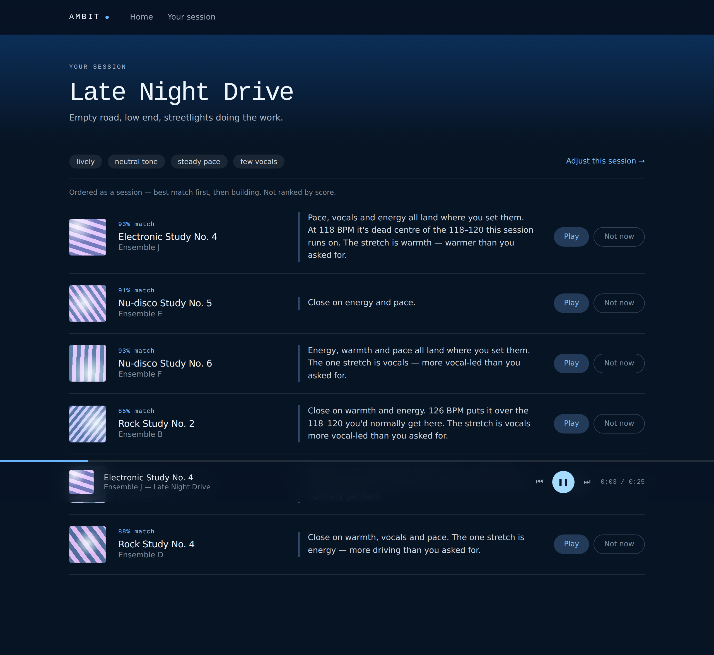

# Ambit

**A music recommender that starts from what you're doing, and shows its working.**

Pick a moment — a long drive, two hours of focus, a slow Sunday — and Ambit
builds a queue for it. Every track arrives with the reason it was chosen, and
that reason is computed from the same numbers that produced the ranking.

<!-- Put a screenshot here. For a lot of reviewers it is the only thing they read. -->


**[Live demo](https://your-deploy-url.vercel.app)** · no login, no account, plays in the browser

---

## The constraint this was built around

Ambit needs four numbers per track: energy, warmth, pace, vocals.

Spotify used to provide them. On **27 November 2024** they deprecated
`/audio-features` and `/audio-analysis`; apps without prior extended access get
`403`, and there is still no replacement. Extended quota now requires an
organisation with 250k monthly active users.

So the pipeline measures the audio itself — Essentia and librosa over Creative
Commons tracks from Jamendo. That change solved a second problem for free:
because the catalogue is CC-licensed, the app can host and play the audio
directly. No OAuth, no Premium requirement, no login wall between a visitor and
the thing they came to see.

## What makes it more than a UI

**Explanations are computed, not written.** Every sentence is assembled from the
per-dial deltas that produced the score:

> *Close on warmth and pace. 108 BPM puts it over the 88–110 you'd normally get
> here. The stretch is vocals — more vocal-led than you asked for.*

Move a slider and every sentence rewrites, because the numbers behind them
changed. The UI cannot claim something the model didn't do — you would have to
break the ranking to break the explanation.

**Tempo bands are derived from the library, not hardcoded.** The bands started
as constants copied from the design mock. That breaks the moment the dials are
percentiles: pace 62 means "faster than 62% of *this* library". Testing caught
it — nearly every pick reported "over the 88–110" — so `lib/bands.ts` now
computes each band from the real tempo distribution near that mood's setting.

**The scoring model has defensible tradeoffs**, each of which is a real decision
you can argue with:

| decision | why |
|---|---|
| weighted distance, not plain mean | energy and pace define a situation more than warmth does |
| vocals weighted lowest (0.75) | it comes from a proxy that confuses solo instruments with singing — weight a signal by how much you trust it |
| single-dial penalty | perfect on three dials and catastrophic on one should not score the same as mediocre everywhere |
| critical-dial veto | averaging cannot express "wrong for the moment" — a lyric-heavy track fails Deep Focus at the thing the session is *for* |
| diversity constraint on selection | top-6-by-score returns six near-identical tracks, because they are all near the same point |
| ascending-energy sequencing | sorting by score means the session gets worse as it plays; a set should build |

**"Not now" re-weights the session.** Rejecting a track steps the dials away
from its profile, weighted by which dial was most wrong. The queue rebuilds.

## Evaluation

`eval/evaluate.py` measures precision@6 against four baselines. The one that
matters is **tempo-only** — if matching BPM alone does as well as four weighted
dials plus a veto plus a penalty, the extra machinery is decoration.

```bash
python eval/evaluate.py --make-labels 200   # blind, stratified worksheet
# fill in "fits": true/false by hand
python eval/evaluate.py
```

The harness reports how many judged tracks back each figure and **refuses to
claim a win when the gap is inside the noise** for the sample size. Sampling is
stratified across the score range on purpose: labelling only what the model
already likes measures nothing.

> Replace this with your real numbers once you've labelled. Report them even if
> they're unflattering — a benchmark you cannot fail is marketing, not
> evaluation.

## Architecture

```
ingest/ (runs once, on your machine)
  fetch_jamendo.py → analyze.py → normalize.py → build.py
                                                      ↓
app/ (static export, no server)                public/tracks.json
  lib/scoring.ts    weighted distance, penalty, veto, diversity
  lib/explain.ts    sentences from live deltas
  lib/bands.ts      tempo bands derived from the shipped library
  lib/theme.ts      per-mood palettes, generated cover art
```

There is **no backend and no runtime API call.** The dataset is read at build
time and inlined; the deployed site is files on a CDN. That is deliberate — the
API this project originally depended on was withdrawn mid-build, and anything in
the live request path can do the same. Nothing here can break while nobody is
watching.

Cover art is generated per track from its own measurements: energy sets
contrast, pace sets band width, vocals open the light in the middle, then the
whole thing rotates around the session's hue so a queue reads as one family.

## Running it

```bash
# 1. build the dataset (see ingest/README.md)
export JAMENDO_CLIENT_ID=your_key
python -m ingest.run --limit 500

# 2. copy outputs into the app
cp public/tracks.json  ../ambit-app/public/
cp -r data/audio       ../ambit-app/public/audio

# 3. run
npm install && npm run dev
```

## Known limitations

Stated here rather than buried, because they're the questions an interviewer
will ask:

- **Vocals is a proxy, not a classifier.** Harmonic ratio × energy in the
  200–4000 Hz voice band. A solo violin scores high; a vocoded vocal scores low.
  Both wrong. This is why it carries the lowest weight, and why the upgrade path
  (Essentia's pretrained voice/instrumental model) is documented in
  `ingest/analyze.py`.
- **Warmth is a definition, not a measurement.** No standard descriptor exists.
  Here it means dark and smooth — low spectral centroid on a log scale, plus
  low-band energy, minus dissonance. Defensible, but a choice.
- **Dials are percentiles within this library.** "Energy 70" means louder and
  busier than 70% of these tracks, not 70% of some absolute maximum. Adding
  tracks shifts everyone's numbers; recalibration takes seconds because raw
  measurements are cached separately from scaling.
- **Saved tracks don't feed back into scoring yet.** They're recorded and unused.

## Licence

Code: MIT. Audio: Creative Commons, individually attributed in the app — every
track links its licence and source. CC is not public domain; if you fork this,
keep the attribution.
